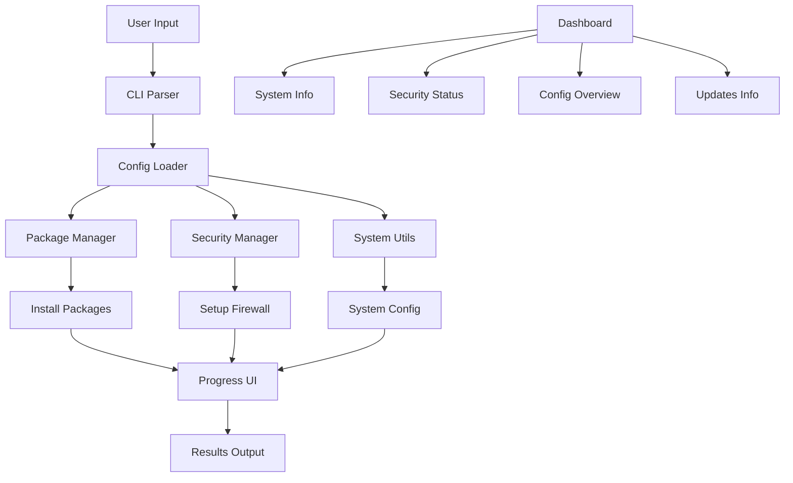

# 🚀 Go-to-Run

### Cross-platform Linux System Configuration Utility

## 📋 Table of Contents

* ✨ Features
* 🚀 Quick Start
* 📦 Installation
* ⚙️ Usage
* 🔧 Configuration
* 📊 Commands

## ✨ Features

Feature | Description | Status  
---|---|---  
🚀 **Cross-platform** | Supports 6+ Linux distributions |  
⚡ **Auto-detection** | Detects distro & package manager automatically |  
🔒 **Security** | UFW, Fail2Ban, SSH hardening | 
📦 **Smart Install** | Parallel package installation with progress |  
🎨 **Beautiful UI** | Colored output, tables, spinners | 
📊 **System Dashboard** | MOTD-style system status dashboard |   
🔄 **Backup/Restore** | Configuration backup system | 
🔧 **Extensible** | Easy to add packages & features |   

## 🚀 Quick Start

### One-line Installation

```bash
curl -sSL https://raw.githubusercontent.com/13winged/go-to-run/main/scripts/install.sh | bash
```

### Basic Usage

```bash
# Full system setup
sudo go-to-run

# Show system dashboard
go-to-run dashboard

# Show system info
go-to-run --info

# Update system only
sudo go-to-run --update
```

## 📦 Installation

### Option 1: Install Script (Recommended)

```bash
# Linux/macOS
curl -sSL https://raw.githubusercontent.com/13winged/go-to-run/main/scripts/install.sh | bash

# With custom installation directory
curl -sSL https://raw.githubusercontent.com/13winged/go-to-run/main/scripts/install.sh | bash -s -- --dir /opt/go-to-run
```

### Option 2: From Source

```bash
git clone https://github.com/13winged/go-to-run.git
cd go-to-run
make build
sudo make install
```

### Option 3: Docker

```bash
docker run --rm -it --privileged 13winged/go-to-run:latest
```

### Option 4: Package Managers

```bash
# Arch Linux (AUR)
yay -S go-to-run

# Homebrew (macOS/Linux)
brew install 13winged/tap/go-to-run
```

## ⚙️ Usage

### Basic Examples

```bash
# Full system setup with default settings
sudo go-to-run

# Show system dashboard
go-to-run dashboard

# Install specific package categories
sudo go-to-run --install --categories=basic,development,network

# Security setup only
sudo go-to-run --security --ssh-port=2222

# Clean system
sudo go-to-run --clean
```

### Advanced Examples

```bash
# Custom configuration file
sudo go-to-run --config /path/to/config.json

# Specific timezone and swap size
sudo go-to-run --timezone America/New_York --swap 8G

# Open specific ports
sudo go-to-run --open-ports 80,443,3000,8080 --allow-ips 192.168.1.0/24
```

## 🔧 Configuration

### Command Line Flags

Flag | Description | Default  
---|---|---  
`--config` | Configuration file | `go-to-run.json`  
`--timezone` | System timezone | `Europe/Moscow`  
`--swap` | Swap size | Auto-calculated  
`--ssh-port` | SSH port | `22`  
`--open-ports` | Additional open ports | `80,443`  
`--categories` | Package categories | `basic,archive,network,monitoring,system`  
`--update, -u` | Update system only | `false`  
`--install, -i` | Install packages only | `false`  
`--security, -s` | Security setup only | `false`  
`--info` | Show system information | `false`  
`--clean, -c` | Clean system only | `false`  

### Configuration File Example

Create `go-to-run.json`:

```json
{
  "system": {
    "timezone": "America/New_York",
    "swap_size": "8G",
    "hostname": "myserver",
    "language": "en_US.UTF-8"
  },
  "security": {
    "ssh_port": 2222,
    "open_ports": [80, 443, 3000, 8080, 9000],
    "allow_ips": ["192.168.1.0/24", "10.0.0.0/8"],
    "enable_ufw": true,
    "enable_fail2ban": true,
    "firewall_rules": [
      {"port": 22, "protocol": "tcp", "action": "allow", "comment": "SSH"},
      {"port": 80, "protocol": "tcp", "action": "allow", "comment": "HTTP"},
      {"port": 443, "protocol": "tcp", "action": "allow", "comment": "HTTPS"}
    ]
  },
  "packages": {
    "basic": ["nano", "vim", "git", "curl", "wget"],
    "network": ["net-tools", "nmap", "traceroute"],
    "development": ["golang-go", "python3", "nodejs", "docker.io"],
    "monitoring": ["htop", "glances", "nmon"]
  }
}
```

## 📊 Commands

### Main Commands

```bash
# Show system dashboard
go-to-run dashboard

# Check system status
sudo go-to-run check

# Real-time monitoring
sudo go-to-run monitor

# Backup configuration
sudo go-to-run backup

# Restore from backup
sudo go-to-run restore /path/to/backup.tar.gz

# List available categories
go-to-run categories

# Show version
go-to-run version
```

### System Dashboard

The `dashboard` command provides a comprehensive MOTD-style overview of your system:

```bash
go-to-run dashboard
```

**Shows:**
- 📊 **System Information**: Hostname, OS, kernel, uptime, CPU load, memory usage
- 🛡️ **Security Status**: SSH, UFW, Fail2Ban status and configuration
- ⚙️ **Configuration**: Current go-to-run settings (timezone, ports, packages)
- 📦 **Updates**: Available package updates
- 🚀 **Quick Actions**: Common commands for system management

### Package Management

```bash
# List installed packages
go-to-run packages list

# Check for updates
go-to-run packages updates

# Install specific package
sudo go-to-run packages install nano vim git

# Remove package
sudo go-to-run packages remove package-name
```

### System Information

```bash
# Full system report
go-to-run info

# Hardware information
go-to-run info hardware

# Network information
go-to-run info network

# Disk usage
go-to-run info disks

# Process list
go-to-run info processes
```

## 📁 Project Structure

```
go-to-run/
├── cmd/go-to-run/          # Main application
├── internal/               # Internal packages
│   ├── config/            # Configuration management
│   ├── system/            # System operations
│   ├── ui/                # User interface
│   └── dashboard/         # System dashboard
├── pkg/archive/           # Archive utilities
├── configs/               # Configuration files
├── scripts/               # Installation scripts
├── examples/              # Usage examples
├── docs/                  # Documentation
├── tests/                 # Test files
└── .github/               # GitHub workflows
```

## 🏗️ Architecture



## 📈 Performance

Operation | Time (Avg) | Packages  
---|---|---  
System Update | 2-5 min | N/A  
Package Install | 30-60 sec | 50 packages  
Security Setup | 10-20 sec | N/A  
Full Setup | 5-10 min | All categories  
Dashboard Display | < 1 sec | N/A  

## 🤝 Contributing

We love contributions! Here's how to help:

### Bug Reports & Feature Requests

* Check existing issues first
* Use issue templates
* Provide system info and logs

### Development Setup

```bash
# Fork & clone
git clone https://github.com/YOUR_USERNAME/go-to-run.git
cd go-to-run

# Install dependencies
go mod download

# Run tests
make test

# Build
make build

# Run locally
./go-to-run --help
```

### Code Guidelines

* Use Go 1.21+ features
* Write tests for new functionality
* Update documentation
* Follow Go conventions
* Use conventional commits

### Pull Request Process

1. Fork the repository
2. Create feature branch
3. Add tests and documentation
4. Ensure tests pass
5. Submit PR with description

## 🐛 Troubleshooting

### Common Issues

Issue | Solution  
---|---  
Permission denied | Use `sudo`  
Package not found | Check distro support  
Network error | Check internet connection  
Config parse error | Validate JSON syntax  

### Debug Mode

```bash
# Enable verbose output
go-to-run --verbose

# Debug specific component
DEBUG=packages go-to-run --install

# Show execution plan
go-to-run --dry-run
```