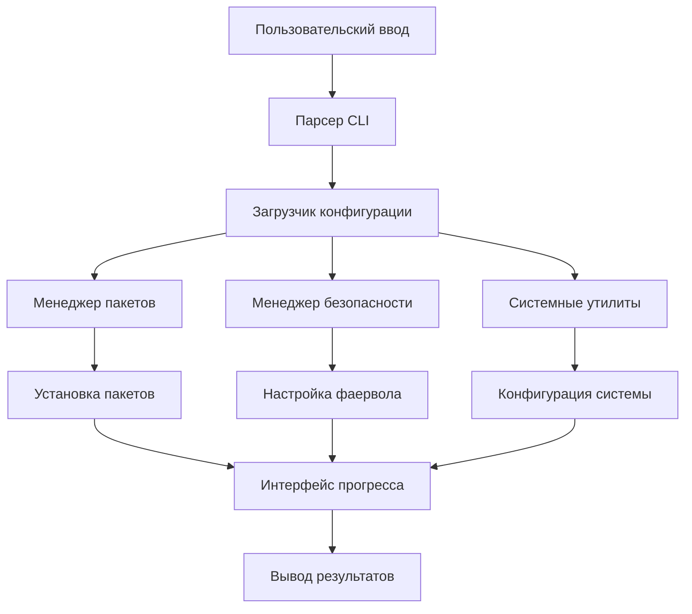

```markdown
<p align="center">
  
</p>

<h1 align="center">🚀 Go-to-Run</h1>
<h3 align="center">Кроссплатформенная утилита для настройки Linux систем</h3>

<p align="center">
  <a href="https://golang.org/"></a>
</p>

<p align="center">
  
</p>

## 📋 Содержание
- [✨ Возможности](#-возможности)
- [🚀 Быстрый старт](#-быстрый-старт)
- [📦 Установка](#-установка)
- [⚙️ Использование](#-использование)
- [🔧 Конфигурация](#-конфигурация)
- [📊 Команды](#-команды)
- [🤝 Участие в разработке](#-участие-в-разработке)
- [📄 Лицензия](#-лицензия)

## ✨ Возможности

| Функция | Описание | Статус |
|---------|----------|--------|
| 🚀 **Кроссплатформенность** | Поддержка 6+ дистрибутивов Linux | ✅ |
| ⚡ **Автоопределение** | Автоматическое определение дистрибутива и менеджера пакетов | ✅ |
| 🔒 **Безопасность** | Настройка UFW, Fail2Ban, защита SSH | ✅ |
| 📦 **Умная установка** | Параллельная установка пакетов с прогресс-баром | ✅ |
| 🎨 **Красивый интерфейс** | Цветной вывод, таблицы, спиннеры | ✅ |
| 🔄 **Бэкап/Восстановление** | Система резервного копирования конфигурации | ✅ |
| 🔧 **Расширяемость** | Легко добавлять пакеты и функции | ✅ |

## 🚀 Быстрый старт

### Установка одной командой
```bash
curl -sSL https://raw.githubusercontent.com/13winged/go-to-run/main/scripts/install.sh | bash
```

### Базовое использование
```bash
# Полная настройка системы
sudo go-to-run

# Показать информацию о системе
go-to-run --info

# Только обновление системы
sudo go-to-run --update
```

## 📦 Установка

### Вариант 1: Скрипт установки (Рекомендуется)
```bash
# Linux/macOS
curl -sSL https://raw.githubusercontent.com/13winged/go-to-run/main/scripts/install.sh | bash

# С кастомной директорией установки
curl -sSL https://raw.githubusercontent.com/13winged/go-to-run/main/scripts/install.sh | bash -s -- --dir /opt/go-to-run
```

### Вариант 2: Из исходников
```bash
git clone https://github.com/13winged/go-to-run.git
cd go-to-run
make build
sudo make install
```

### Вариант 3: Docker
```bash
docker run --rm -it --privileged 13winged/go-to-run:latest
```

### Вариант 4: Менеджеры пакетов
```bash
# Arch Linux (AUR)
yay -S go-to-run

# Homebrew (macOS/Linux)
brew install 13winged/tap/go-to-run
```

## ⚙️ Использование

### Базовые примеры
```bash
# Полная настройка системы с настройками по умолчанию
sudo go-to-run

# Установка конкретных категорий пакетов
sudo go-to-run --install --categories=basic,development,network

# Только настройка безопасности
sudo go-to-run --security --ssh-port=2222

# Очистка системы
sudo go-to-run --clean
```

### Расширенные примеры
```bash
# Кастомный конфигурационный файл
sudo go-to-run --config /path/to/config.json

# Специфичный часовой пояс и размер swap
sudo go-to-run --timezone Europe/Moscow --swap 8G

# Открытие конкретных портов
sudo go-to-run --open-ports 80,443,3000,8080 --allow-ips 192.168.1.0/24
```

## 🔧 Конфигурация

### Флаги командной строки
| Флаг | Описание | По умолчанию |
|------|----------|--------------|
| `--config` | Конфигурационный файл | `go-to-run.json` |
| `--timezone` | Часовой пояс системы | `Europe/Moscow` |
| `--swap` | Размер swap | Авторасчет |
| `--ssh-port` | SSH порт | `22` |
| `--open-ports` | Дополнительные открытые порты | `80,443` |
| `--categories` | Категории пакетов | `basic,archive,network,monitoring,system` |
| `--update, -u` | Только обновить систему | `false` |
| `--install, -i` | Только установить пакеты | `false` |
| `--security, -s` | Только настройка безопасности | `false` |
| `--info` | Показать информацию о системе | `false` |
| `--clean, -c` | Только очистка системы | `false` |

### Пример конфигурационного файла
Создайте `go-to-run.json`:
```json
{
  "system": {
    "timezone": "Europe/Moscow",
    "swap_size": "8G",
    "hostname": "мойсервер",
    "language": "ru_RU.UTF-8"
  },
  "security": {
    "ssh_port": 2222,
    "open_ports": [80, 443, 3000, 8080, 9000],
    "allow_ips": ["192.168.1.0/24", "10.0.0.0/8"],
    "enable_ufw": true,
    "enable_fail2ban": true,
    "firewall_rules": [
      {"port": 22, "protocol": "tcp", "action": "allow", "comment": "SSH"},
      {"port": 80, "protocol": "tcp", "action": "allow", "comment": "HTTP"},
      {"port": 443, "protocol": "tcp", "action": "allow", "comment": "HTTPS"}
    ]
  },
  "packages": {
    "basic": ["nano", "vim", "git", "curl", "wget"],
    "network": ["net-tools", "nmap", "traceroute"],
    "development": ["golang-go", "python3", "nodejs", "docker.io"],
    "monitoring": ["htop", "glances", "nmon"]
  }
}
```

## 📊 Команды

### Основные команды
```bash
# Проверка состояния системы
sudo go-to-run check

# Мониторинг в реальном времени
sudo go-to-run monitor

# Создание бэкапа конфигурации
sudo go-to-run backup

# Восстановление из бэкапа
sudo go-to-run restore /path/to/backup.tar.gz

# Список доступных категорий
go-to-run categories

# Показать версию
go-to-run version
```

### Управление пакетами
```bash
# Список установленных пакетов
go-to-run packages list

# Проверка обновлений
go-to-run packages updates

# Установка конкретного пакета
sudo go-to-run packages install nano vim git

# Удаление пакета
sudo go-to-run packages remove package-name
```

### Информация о системе
```bash
# Полный отчет о системе
go-to-run info

# Информация о железе
go-to-run info hardware

# Сетевая информация
go-to-run info network

# Использование дисков
go-to-run info disks

# Список процессов
go-to-run info processes
```

## 📁 Структура проекта
```
go-to-run/
├── cmd/go-to-run/          # Основное приложение
├── internal/               # Внутренние пакеты
│   ├── config/            # Управление конфигурацией
│   ├── system/            # Системные операции
│   └── ui/                # Пользовательский интерфейс
├── pkg/archive/           # Утилиты для архивов
├── configs/               # Файлы конфигурации
├── scripts/               # Скрипты установки
├── examples/              # Примеры использования
├── docs/                  # Документация
├── tests/                 # Тестовые файлы
└── .github/               # GitHub workflows
```

## 🏗️ Архитектура


## 📈 Производительность

| Операция | Время (среднее) | Пакеты |
|----------|-----------------|--------|
| Обновление системы | 2-5 мин | N/A |
| Установка пакетов | 30-60 сек | 50 пакетов |
| Настройка безопасности | 10-20 сек | N/A |
| Полная настройка | 5-10 мин | Все категории |

## 🤝 Участие в разработке

Мы рады вкладу в проект! Вот как можно помочь:

### Отчеты об ошибках и запросы функций
- Проверьте существующие issues
- Используйте шаблоны issues
- Предоставьте информацию о системе и логи

### Настройка среды разработки
```bash
# Форк и клонирование
git clone https://github.com/YOUR_USERNAME/go-to-run.git
cd go-to-run

# Установка зависимостей
go mod download

# Запуск тестов
make test

# Сборка
make build

# Запуск локально
./go-to-run --help
```

### Рекомендации по коду
- Используйте функции Go 1.21+
- Пишите тесты для новой функциональности
- Обновляйте документацию
- Следуйте соглашениям Go
- Используйте conventional commits

### Процесс Pull Request
1. Форкните репозиторий
2. Создайте ветку для функции
3. Добавьте тесты и документацию
4. Убедитесь, что тесты проходят
5. Отправьте PR с описанием

## 🐛 Решение проблем

### Частые проблемы
| Проблема | Решение |
|----------|---------|
| Permission denied | Используйте `sudo` |
| Пакет не найден | Проверьте поддержку дистрибутива |
| Ошибка сети | Проверьте подключение к интернету |
| Ошибка парсинга конфигурации | Проверьте синтаксис JSON |

### Режим отладки
```bash
# Включение подробного вывода
go-to-run --verbose

# Отладка конкретного компонента
DEBUG=packages go-to-run --install

# Показать план выполнения
go-to-run --dry-run
```