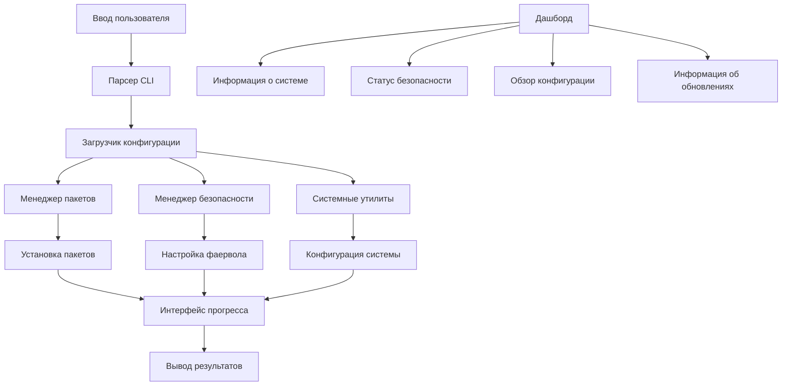

# 🚀 Go-to-Run

### Кроссплатформенная утилита для автоматической настройки Linux систем

## 📋 Содержание

* ✨ Возможности
* 🚀 Быстрый старт
* 📦 Установка
* ⚙️ Использование
* 🔧 Конфигурация
* 📊 Команды

## ✨ Возможности

Возможность | Описание | Статус  
---|---|---  
🚀 **Кроссплатформенность** | Поддержка 6+ дистрибутивов Linux |
⚡ **Автоопределение** | Автоматическое определение дистрибутива и менеджера пакетов |  
🔒 **Безопасность** | Настройка UFW, Fail2Ban, SSH | 
📦 **Умная установка** | Параллельная установка пакетов с прогресс-баром |  
🎨 **Красивый интерфейс** | Цветной вывод, таблицы, спиннеры | 
📊 **Системный дашборд** | MOTD-стиль дашборд состояния системы |  
🔄 **Резервное копирование** | Система бэкапа конфигурации |  
🔧 **Расширяемость** | Легкое добавление пакетов и функций |   

## 🚀 Быстрый старт

### Установка одной командой

```bash
curl -sSL https://raw.githubusercontent.com/13winged/go-to-run/main/scripts/install.sh | bash
```

### Основное использование

```bash
# Полная настройка системы
sudo go-to-run

# Показать системный дашборд
go-to-run dashboard

# Показать информацию о системе
go-to-run --info

# Только обновление системы
sudo go-to-run --update
```

## 📦 Установка

### Вариант 1: Скрипт установки (рекомендуется)

```bash
# Linux/macOS
curl -sSL https://raw.githubusercontent.com/13winged/go-to-run/main/scripts/install.sh | bash

# С пользовательской директорией установки
curl -sSL https://raw.githubusercontent.com/13winged/go-to-run/main/scripts/install.sh | bash -s -- --dir /opt/go-to-run
```

### Вариант 2: Из исходного кода

```bash
git clone https://github.com/13winged/go-to-run.git
cd go-to-run
make build
sudo make install
```

### Вариант 3: Docker

```bash
docker run --rm -it --privileged 13winged/go-to-run:latest
```

### Вариант 4: Менеджеры пакетов

```bash
# Arch Linux (AUR)
yay -S go-to-run

# Homebrew (macOS/Linux)
brew install 13winged/tap/go-to-run
```

## ⚙️ Использование

### Основные примеры

```bash
# Полная настройка системы с настройками по умолчанию
sudo go-to-run

# Показать системный дашборд
go-to-run dashboard

# Установить определенные категории пакетов
sudo go-to-run --install --categories=basic,development,network

# Только настройка безопасности
sudo go-to-run --security --ssh-port=2222

# Только очистка системы
sudo go-to-run --clean
```

### Расширенные примеры

```bash
# Пользовательский файл конфигурации
sudo go-to-run --config /path/to/config.json

# Определенный часовой пояс и размер swap
sudo go-to-run --timezone Europe/Moscow --swap 8G

# Открыть определенные порты
sudo go-to-run --open-ports 80,443,3000,8080 --allow-ips 192.168.1.0/24
```

## 🔧 Конфигурация

### Флаги командной строки

Флаг | Описание | По умолчанию  
---|---|---  
`--config` | Файл конфигурации | `go-to-run.json`  
`--timezone` | Часовой пояс системы | `Europe/Moscow`  
`--swap` | Размер swap | Авторасчет  
`--ssh-port` | SSH порт | `22`  
`--open-ports` | Дополнительные открытые порты | `80,443`  
`--categories` | Категории пакетов | `basic,archive,network,monitoring,system`  
`--update, -u` | Только обновление системы | `false`  
`--install, -i` | Только установка пакетов | `false`  
`--security, -s` | Только настройка безопасности | `false`  
`--info` | Показать информацию о системе | `false`  
`--clean, -c` | Только очистка системы | `false`  

### Пример файла конфигурации

Создайте `go-to-run.json`:

```json
{
  "system": {
    "timezone": "Europe/Moscow",
    "swap_size": "8G",
    "hostname": "myserver",
    "language": "ru_RU.UTF-8"
  },
  "security": {
    "ssh_port": 2222,
    "open_ports": [80, 443, 3000, 8080, 9000],
    "allow_ips": ["192.168.1.0/24", "10.0.0.0/8"],
    "enable_ufw": true,
    "enable_fail2ban": true,
    "firewall_rules": [
      {"port": 22, "protocol": "tcp", "action": "allow", "comment": "SSH"},
      {"port": 80, "protocol": "tcp", "action": "allow", "comment": "HTTP"},
      {"port": 443, "protocol": "tcp", "action": "allow", "comment": "HTTPS"}
    ]
  },
  "packages": {
    "basic": ["nano", "vim", "git", "curl", "wget"],
    "network": ["net-tools", "nmap", "traceroute"],
    "development": ["golang-go", "python3", "nodejs", "docker.io"],
    "monitoring": ["htop", "glances", "nmon"]
  }
}
```

## 📊 Команды

### Основные команды

```bash
# Показать системный дашборд
go-to-run dashboard

# Проверить состояние системы
sudo go-to-run check

# Мониторинг в реальном времени
sudo go-to-run monitor

# Создать резервную копию конфигурации
sudo go-to-run backup

# Восстановить из резервной копии
sudo go-to-run restore /path/to/backup.tar.gz

# Список доступных категорий
go-to-run categories

# Показать версию
go-to-run version
```

### Системный дашборд

Команда `dashboard` предоставляет полный обзор состояния системы в стиле MOTD:

```bash
go-to-run dashboard
```

**Показывает:**
- 📊 **Информация о системе**: Имя хоста, ОС, ядро, время работы, загрузка CPU, использование памяти
- 🛡️ **Статус безопасности**: Статус SSH, UFW, Fail2Ban и конфигурация
- ⚙️ **Конфигурация**: Текущие настройки go-to-run (часовой пояс, порты, пакеты)
- 📦 **Обновления**: Доступные обновления пакетов
- 🚀 **Быстрые действия**: Распространенные команды для управления системой

### Управление пакетами

```bash
# Список установленных пакетов
go-to-run packages list

# Проверить обновления
go-to-run packages updates

# Установить определенные пакеты
sudo go-to-run packages install nano vim git

# Удалить пакет
sudo go-to-run packages remove имя-пакета
```

### Информация о системе

```bash
# Полный отчет о системе
go-to-run info

# Информация о железе
go-to-run info hardware

# Сетевая информация
go-to-run info network

# Использование диска
go-to-run info disks

# Список процессов
go-to-run info processes
```

## 📁 Структура проекта

```
go-to-run/
├── cmd/go-to-run/          # Основное приложение
├── internal/               # Внутренние пакеты
│   ├── config/            # Управление конфигурацией
│   ├── system/            # Системные операции
│   ├── ui/                # Пользовательский интерфейс
│   └── dashboard/         # Системный дашборд
├── pkg/archive/           # Утилиты для работы с архивами
├── configs/               # Файлы конфигурации
├── scripts/               # Скрипты установки
├── examples/              # Примеры использования
├── docs/                  # Документация
├── tests/                 # Тестовые файлы
└── .github/               # GitHub workflows
```

## 🏗️ Архитектура



## 📈 Производительность

Операция | Время (среднее) | Пакеты  
---|---|---  
Обновление системы | 2-5 мин | N/A  
Установка пакетов | 30-60 сек | 50 пакетов  
Настройка безопасности | 10-20 сек | N/A  
Полная настройка | 5-10 мин | Все категории  
Отображение дашборда | < 1 сек | N/A  

## 🤝 Участие в разработке

Мы рады вкладу! Вот как можно помочь:

### Сообщения об ошибках и запросы функций

* Проверьте существующие issues
* Используйте шаблоны issues
* Предоставьте информацию о системе и логи

### Настройка среды разработки

```bash
# Форкните и склонируйте репозиторий
git clone https://github.com/YOUR_USERNAME/go-to-run.git
cd go-to-run

# Установите зависимости
go mod download

# Запустите тесты
make test

# Соберите проект
make build

# Запустите локально
./go-to-run --help
```

### Рекомендации по коду

* Используйте функции Go 1.21+
* Пишите тесты для новой функциональности
* Обновляйте документацию
* Следуйте соглашениям Go
* Используйте conventional commits

### Процесс Pull Request

1. Форкните репозиторий
2. Создайте ветку для функции
3. Добавьте тесты и документацию
4. Убедитесь, что тесты проходят
5. Отправьте PR с описанием

## 🐛 Устранение неполадок

### Распространенные проблемы

Проблема | Решение  
---|---  
Permission denied | Используйте `sudo`  
Package not found | Проверьте поддержку дистрибутива  
Network error | Проверьте подключение к интернету  
Config parse error | Проверьте синтаксис JSON  

### Режим отладки

```bash
# Включить подробный вывод
go-to-run --verbose

# Отладка конкретного компонента
DEBUG=packages go-to-run --install

# Показать план выполнения
go-to-run --dry-run
```